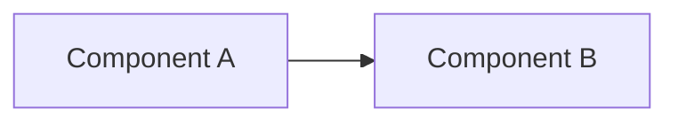

# Sunray Documentation

Write and maintain documentation for the Sunray Alfred fork.

## Documentation locations

### In-repo (`docs/`)
Architecture, design, and technical reference that should version-control with the code.

### Nextcloud notes (`~/Nextcloud/Rouven-Notes/Nederbyvej/Alfred/`)
Operational notes, mower state analysis, investigation logs. These are personal reference docs.

### README.md
Short entry point: what this fork is, how to build, how to deploy.

## Creating a new docs page

1. Create the file in `docs/` with kebab-case naming: `docs/<topic>.md`
2. Add a reference from `README.md` if it's important for onboarding
3. Use Mermaid diagrams for architecture and data flow visualization

## Doc templates

### Architecture document
```markdown
# <Component> Architecture

## Overview
One paragraph: what this component does and its role in the system.

## Components


## Data Flow
Describe the key data flows with Mermaid sequence or flowchart diagrams.

## Key Files
| File | Purpose |
|---|---|
| `path/to/file.cpp` | Description |

## Configuration
List relevant `#define` options from config.h.
```

### Config reference entry
```markdown
### `DEFINE_NAME`
- **Type**: boolean / integer / float / string
- **Default**: `value`
- **Effect**: What this setting controls
- **Valid range**: constraints
- **Example**: `#define DEFINE_NAME value`
```

## Mermaid diagram conventions

- Use `graph LR` (left-to-right) for data flow
- Use `graph TD` (top-down) for hierarchies
- Use `sequenceDiagram` for protocol exchanges
- Keep diagrams focused — one per concept, not one mega-diagram
- Use descriptive node labels, not abbreviations

## Style

- Technical and concise — firmware audience
- Code blocks for all commands, configs, and code references
- Tables for structured reference data
- No marketing language or feature hype
