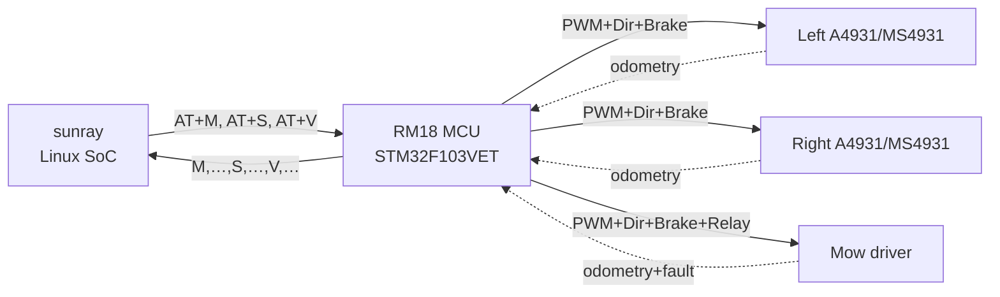

# RM18 Firmware Interface

Reference for the Alfred RM18/RM24A drive-controller firmware
(`linux/firmware/rm18.ino`, current version `RM18,1.1.16`) and how it
interacts with the sunray host process.

## Overview

The RM18 is an STM32F103VET-based motor controller mounted in Alfred.
It drives three motors (two traction motors via A4931ET/MS4931
brushless drivers, one mowing motor), reads battery / charger /
bumper / lift / rain / stop-button sensors, and exposes everything to
sunray through a serial AT protocol.

Sunray (running on the Alfred Linux SoC) is the brain; RM18 is a
relatively dumb I/O node with a small number of built-in safety
behaviours. This document is the reference for those behaviours and
how the AT protocol maps them.



## AT protocol

All commands are ASCII, `\r\n`-terminated, and carry an 8-bit additive
CRC appended as `,0xHH`. The RM18 rejects commands whose CRC does not
match.

Two physical endpoints share the same command parser:
- `CONSOLE` — `SoftwareSerial` on the display connector (19200 baud)
- `CONSOLE2` — hardware UART on the NGP PCB (115200 baud)

Commands received on either endpoint are answered on the same
endpoint.

### `AT+V` — version

Request:
```
AT+V,0x16
```
Response:
```
V,RM18,1.1.16,0x<crc>
```

### `AT+M,<left>,<right>,<mow>` — set motor PWM

Sets target PWM (−255…+255) for the two traction motors and mow
motor. Zero values engage the traction brakes after a short grace
period (see Safety § Traction brakes).

Response contains the cumulative odometry tick counts since boot and
a snapshot of the sensor flags — sunray reads this synchronously and
uses it to drive its encoder-based speed control.

```
M,<odomL>,<odomR>,<odomMow>,<chgV>,<bumper>,<lift>,<stopButton>,0x<crc>
```

Fields:

| Field | Type | Source |
|---|---|---|
| `odomL` | int32 | Hall-impulse count, left traction motor |
| `odomR` | int32 | Hall-impulse count, right traction motor |
| `odomMow` | int32 | Hall-impulse count, mowing motor |
| `chgV` | float | Charger voltage (V), instantaneous |
| `bumper` | 0/1 | Bumper-X or bumper-Y outside dead zone |
| `lift` | 0/1 | Both lift sensors outside dead zone |
| `stopButton` | 0/1 | Emergency stop active |

**Watchdog**: if RM18 receives no `AT+M` for 3000 ms it forces
`leftSpeedSet = rightSpeedSet = mowSpeedSet = 0`. Sunray's own
watchdog (`setLinearAngularSpeedTimeout`) is 1000 ms, so this is only
a safety net.

### `AT+S` — summary

Periodic status poll, also CRC-protected. Response:

```
S,<batV>,<chgV>,<chgI>,<lift>,<bumper>,<raining>,<motorOverload>,
  <mowCurrLP>,<motorLeftCurrLP>,<motorRightCurrLP>,<batteryTemp>,0x<crc>
```

Fields most relevant to steering diagnostics:

| Field | Meaning | Notes |
|---|---|---|
| `motorOverload` | 0/1 | Set by RM18's internal over-current protection |
| `motorLeftCurrLP` | float (A) | LP-filtered left traction current |
| `motorRightCurrLP` | float (A) | LP-filtered right traction current |
| `mowCurrLP` | float (A) | LP-filtered mow-motor current |

### `AT+Y` — trigger watchdog (developer-only)

Deliberately hangs RM18 to test the 6 s IWatchdog reset. Do not send
in production.

## Motor driver characteristics

### PWM deadband clamp (MS4931 workaround)

```cpp
if ((leftSpeedSet > 0) && (leftSpeedSet < 15)) leftSpeedSet = 15;
// mirrored for negative and for right side
```

The MS4931 brushless driver reports corrupt odometry / tire speeds
below a minimum duty cycle. RM18 bumps any non-zero PWM request below
15/255 up to 15/255. **This is why sunray defines `MIN_WHEEL_SPEED`
(0.05 m/s)** — anything below gets clamped anyway, so commanding it
is worse than useless.

### Inverted PWM output

```cpp
analogWrite(pinMotorLeftPWM, 255 - abs(leftSpeedSet));
```

A4931ET logic is low-active; RM18 inverts. Transparent to sunray.

### Dead-request stop-and-brake

When both left and right are zero *and* the mow is zero, RM18 enables
the traction brake pins:

```cpp
if ((leftSpeedSet == 0) && (rightSpeedSet == 0)) enableTractionBrakes = true;
digitalWrite(pinMotorLeftBrake,  !enableTractionBrakes);
digitalWrite(pinMotorRightBrake, !enableTractionBrakes);
```

### Mow-motor "kick-start" state machine

Entering mow from `mowSpeedSet = 0` the firmware cycles the relay
(brake) and PWM=255 for up to 3 iterations before settling on the
commanded PWM. Designed to overcome static friction on the mow
blade — not relevant for traction stall analysis.

## Built-in safety behaviours

### Over-current shutdown

```cpp
if ((mowCurrLP > 4.0) || (motorLeftCurrLP > 1.5) || (motorRightCurrLP > 1.5)) {
  motorOverload = true;
  motorOverloadTimeout = millis() + 2000;
}
```

If any LP-filtered motor current exceeds its threshold RM18 sets
`motorOverload = true` for 2 seconds. In `motor()` this forces
`leftSpeedSet = rightSpeedSet = 0` — i.e. RM18 **silently stops both
traction motors**, regardless of what sunray commands, for the full
2 s timeout.

Sunray sees this indirectly:

- The `motorOverload` bit in the next `AT+S` response goes to 1.
- Sunray also computes its own per-side `motorLeftOverload` /
  `motorRightOverload` locally from the same `curL/curR` values using
  `MOTOR_OVERLOAD_CURRENT` (= 1.2 A in [sunray/config.h](../sunray/config.h)),
  which fires **before** RM18's 1.5 A threshold.

Important consequence for stall debugging: a one-shot current spike
(e.g. caster jam on grass) *could* trip RM18 briefly, causing a 2 s
both-wheels-stop that sunray cannot distinguish from a mechanical
stall unless the `motorOverload` flag or sunray's 1.2 A pre-trigger
fire in the log.

### Current-sense ADC is cube-root calibrated

```cpp
motorLeftCurr  = pow((float)analogRead(pinMotorLeftCurr),  1.0/3.0) / 4.0;
motorRightCurr = pow((float)analogRead(pinMotorRightCurr), 1.0/3.0) / 4.0;
mowCurr        = pow((float)analogRead(pinMotorMowCurr),   1.0/3.0) / 2.0;
```

The transfer function is not linear:

| ADC | Reported current |
|---|---|
| 0 | 0.00 A |
| 8 | 0.50 A |
| 32 | 0.79 A (typical idle offset) |
| 64 | 1.00 A |
| 216 | 1.50 A (RM18 overload threshold) |
| 512 | 2.00 A |
| 1024 | 2.52 A |

**Zero-PWM idle reading is ~0.13–0.21 A** (observed in aufbock test
on batman, April 2026). This is sensor offset / bias, not real motor
current. Subtract it when interpreting `motorLeftCurrLP` /
`motorRightCurrLP` at rest.

The cube-root shape compresses the high-current region. A "0.88 A"
reading in an `AT+S` corresponds to real motor current ≈ 0.68 A once
you subtract the offset — still well below the 1.5 A trip threshold.

### Over-voltage check and stop button

- `pinOVCheck` is a digital input; its state is reported as `ovCheck`
  but there is no automatic response in RM18 — sunray must act on it.
- The emergency stop button (`pinStopButton`) is handled by an ISR
  with 5 ms debounce and latches for at least 20 s after release. The
  flag rides in the `AT+M` response.

### Low-PWM odometry spike filter

The odometry ISRs use a 3 ms (or adaptive in
`SUPER_SPIKE_ELIMINATOR`) dead-time after each transition to discard
brushless commutation spikes. If ticks are being dropped at
high RPM this is the place to check.

### IWatchdog

RM18 enables a 6 s STM32 IWatchdog in `setup()`. Any code path that
blocks the main loop longer than 6 s triggers a hardware reset.
`cmdTriggerWatchdog()` (`AT+Y`) deliberately hangs to test this.

## Pin map (traction-motor relevant)

| Pin | Function |
|---|---|
| `PE13` | Left PWM |
| `PD8` | Left brake |
| `PD9` | Left direction |
| `PD1` | Left impulse (Hall) |
| `PC0` | Left current ADC |
| `PE9` | Right PWM |
| `PB12` | Right brake |
| `PB13` | Right direction |
| `PD0` | Right impulse (Hall) |
| `PC1` | Right current ADC |

Full map in the header of [`rm18.ino`](../linux/firmware/rm18.ino).

## What RM18 does *not* do

- No stall detection based on missing encoder ticks.
- No per-wheel braking on overload — it's an all-wheels stop.
- No rate limit on PWM changes (no ramp).
- No active current limiting; only the on/off 1.5 A / 4.0 A trip.
- No reporting of individual driver fault pins for the traction
  motors (only the mow driver's `pinMotorMowFault` is exposed, and
  even that is only in the `AT+S` decision for `motorMowFault`).

Everything else — stall detection, wheel-speed PID, obstacle
response, one-wheel-turn mitigation, GPS no-motion — lives in sunray.

## Implications for sunray fixes

1. **`MIN_WHEEL_SPEED 0.05` is required.** Any lower setpoint is
   either clamped by RM18 (PWM ≥ 15) or stuck in the
   "MS4931 corrupt odometry" region.
2. **Current-based stall detection in sunray must use the real
   (offset-subtracted, nonlinear) value**, not the raw `curL/curR`
   field — otherwise a resting robot looks like it's drawing 0.2 A.
3. **A 2 s "silent stop" window exists** whenever RM18 over-current
   triggers. Sunray's own 1.2 A threshold fires first, so this should
   be visible in the log as `motor overload detected: reducing linear
   speed` *before* RM18 cuts off. If an ONE-WHEEL event happens
   without that preceding log line, RM18 silent-stop is not the
   cause.
4. **ONE-WHEEL detector must gate on sunray's own PWM variable**, not
   on expected-PWM. If RM18 has silently zeroed the motor during its
   2 s window, sunray's `motorLeftPWMCurr` still shows the PID
   output — so the detector will correctly flag a stall. See
   `STALL_DETECT_PWM_MIN` in [`sunray/config.h`](../sunray/config.h).

## Related docs

- [AT_Protocol.md](AT_Protocol.md) — external (WiFi/BLE) AT+V/M/C/S
  for host-to-sunray; different protocol, same name prefix.
- [Motor_Control_Alfred.md](Motor_Control_Alfred.md) — host-side
  motor control architecture.
- [steering-analysis-2026-04.md](steering-analysis-2026-04.md) —
  investigation that led to this reference.
