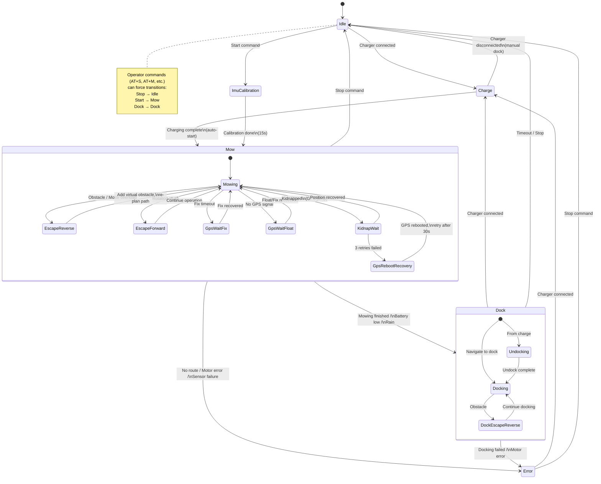
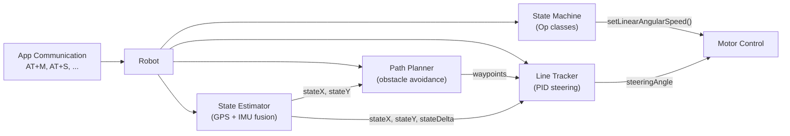

# Sunray State Machine

Mermaid version of `doc/Sunray_fsm.png`. Generated from the Op source files in `sunray/src/op/`.

## State Machine

## Architecture Overview

## Op Classes

| Op class | Source file | Purpose |
|---|---|---|
| `IdleOp` | `src/op/IdleOp.cpp` | Motors off, waiting for command |
| `MowOp` | `src/op/MowOp.cpp` | Main mowing loop with path following |
| `DockOp` | `src/op/DockOp.cpp` | Navigate to charger via dock points |
| `ChargeOp` | `src/op/ChargeOp.cpp` | Charging, auto-start on completion |
| `ErrorOp` | `src/op/ErrorOp.cpp` | Emergency stop on critical failure |
| `EscapeReverseOp` | `src/op/EscapeReverseOp.cpp` | Reverse 3s on obstacle |
| `EscapeForwardOp` | `src/op/EscapeForwardOp.cpp` | Forward 2s on rotation stuck |
| `GpsWaitFixOp` | `src/op/GpsWaitFixOp.cpp` | Wait for RTK fix |
| `GpsWaitFloatOp` | `src/op/GpsWaitFloatOp.cpp` | Wait for float or fix |
| `GpsRebootRecoveryOp` | `src/op/GpsRebootRecoveryOp.cpp` | Reboot GPS, wait 30s |
| `KidnapWaitOp` | `src/op/KidnapWait.cpp` | Wait after GPS jump (kidnap detect) |
| `ImuCalibrationOp` | `src/op/ImuCalibrationOp.cpp` | 15s gyro calibration at startup |
| `RelocalizationOp` | `src/op/RelocalizationOp.cpp` | LiDAR relocalization (ROS mode) |
